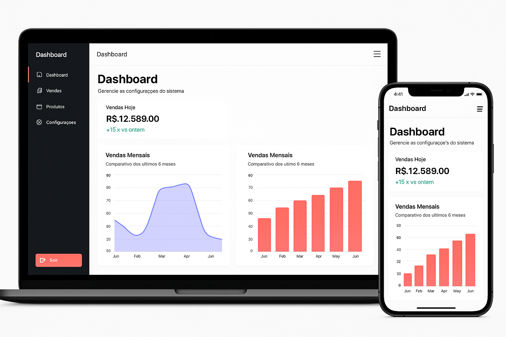

# 🛍️ Gerenciador de Produtos

Sistema de controle e análise de produtos com foco em responsividade, visualização de dados e facilidade de uso. Desenvolvido com **React** e **Vite**.

## 📸 Demonstração

### 💻 Versão Desktop e 📱 Versão Mobile



## 🚀 Tecnologias Utilizadas

- [React](https://reactjs.org/)
- [Vite](https://vitejs.dev/)
- [Tailwind CSS](https://tailwindcss.com/)
- [Chart.js ou Recharts](https://www.chartjs.org/)
- [React Router DOM](https://reactrouter.com/en/main)

## 🔧 Funcionalidades

- 📦 Cadastro e listagem de produtos
- 📊 Visualização de vendas diárias e mensais
- 📉 Indicador automático de nível de estoque (Baixo, Médio, Alto)
- 📱 Interface responsiva para desktop e mobile
- ⚙️ Painel administrativo com navegação simples e moderna

## ⚙️ Instalação e Uso

```bash
# Clone o repositório
git clone https://github.com/Yuurij-dev/Gerenciador-de-Produtos

# Acesse o diretório
cd gestao_de_produto

# Instale as dependências
npm install

# Inicie o servidor de desenvolvimento
npm run dev
```
